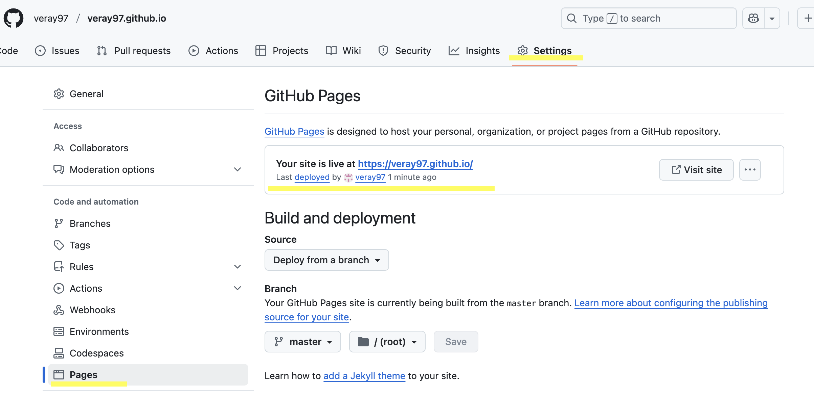

# Goal
**Use the Academic Page template in https://github.com/academicpages/academicpages.github.io to create your personal academic webpage

## Step 1: 

Open the https://github.com/academicpages/academicpages.github.io, follow the "Getting Started" step in theb "README.md" to mimic the template in your own repository

### Getting Started
1. Register a GitHub account if you don't have one and confirm your e-mail (required!)
1. Click the "Use this template" button in the top right.
1. On the "New repository" page, enter your repository name as "[your GitHub username].github.io", which will also be your website's URL.
1. Set site-wide configuration and add your content.
1. Upload any files (like PDFs, .zip files, etc.) to the `files/` directory. They will appear at https://[your GitHub username].github.io/files/example.pdf.
1. Check status by going to the repository settings, in the "GitHub pages" section
1. (Optional) Use the Jupyter notebooks or python scripts in the `markdown_generator` folder to generate markdown files for publications and talks from a TSV file.

### Webpage

You can now open your webpage through the link

## Trouble shooting as this step:

(One problem may occur if you didn't name the github webpage as https://[your GitHub username].github.io. For example, if I name the repocitory as verayang.github.io, then there may the problem shown below. This can not be fixed even though you rename this created repository. The solution is to repeat the "getting started" step and name the repository correctly when you create it.)

Error: At the beginning of this step, if you open your webpage (as for me, it's https://veray97.github.io/), and open the "developer tools"-"Sources". You can see that the repository used under this webpage. If it's shown as below, which is that a part of it is still acadeicpages.github.io. It means that the edits you made and the images you added under your repository will not be recognized by the webpage.

## Step 2:
After you modify the _config.yml and _data/navigation.yml, there is still quite a lot contents need to be updated. If you want to have more functions but you don't know much about coding, you can download "Cursor" on your laptop. This can assist you to realize the function you want.

Required App in Laptop:
1. Cursor
2. Github

Open the terminal and input the codes below to setup the connection. Our goal is to connect the local folder with the github repository,which is similar to folder holding all our files for the project. In this way, if we make edits in our local folder, we can push the updated version to repository to make sure these edits are also refreshed in github
1. Navigate to local empty folder you created to holder the files.
cd path/to/your/folder

3. Initialize Git (if not already initialized)
git init

3. Add the GitHub repository as remote(For me, it's https://github.com/veray97/veray97.github.io.git)
git remote add origin https://github.com/username/repository-name.git

4. Pull the existing content (The default branch on GitHub is master (not main))
git pull origin master

## Step 3:
If you see the local folder now contain all the files from your github repository, congratulations, you are now on high way!

Now, open Cursor and then click "Open Project"-choose the local folder we created in step 2. You will see the cursor as below if you open project successfully. 

Then you can use the chatbox on the left to ask any questions. 

For example, I didn't learn how to create a webpage so that I'm conservative on making edits to make sure my edits will not disable some functions or ruin the codes. My goal now is only to edit the content on the webpage to replace them with my perdsonal introductions.

Then you can ask: "Please read all the files under current foler. This is a project about a presonal webpage created under github.io. However I want to modify the content on the webpage. I only know what is shown on the webpage with content like "This is the front page of a website that is powered by", but I don't know where is it located. Can you help me to find it?"

Great, now you can go to this file in local folder and replace it with your personal contents.

## Step 4:
All the edits you made now are in local folder, so we want the github repository to be refreshed. Then you can open terminal and enter the four lines of codes below so that the github repository will also be updated to the status of your local folder. 

cd path/to/your/folder
git status
git add . && git status
git commit -m “Name_of_change“ && git push

In "Name_of_change", please name the change you made in local folder, for example "image add" or "main page updated".I didn't know the importance until I learn how github works, whcih is shown below:

How GitHub Records Changes
      GitHub uses the Git version control system to track and manage code changes. 
      The core features of this system include:
          Commits: Each commit is a snapshot of the codebase at a specific point in time, containing the state of all files
          Diffs: Git stores the changes to files rather than complete copies, which saves space
          History: All changes have timestamps and author information, forming a complete historical record
Git's Working Model
      Git is more accurately described as a "content-addressable file system" rather than a pure state mechanism:
      Git tracks changes in file content, not just file states
      Each commit creates a snapshot of the entire project, not just a transition of states
      Each commit and file content is uniquely identified by a hash value (SHA-1)
Advantages of Version Control
      This method of recording changes offers several key advantages:
      Comprehensive history: You can view the code state at any point in time
      Collaboration capabilities: Multiple people can work on the same codebase simultaneously
      Branch management: You can create different development lines that don't interfere with each other
      Rollback ability: You can easily return to any previous version
      
## Step 5: