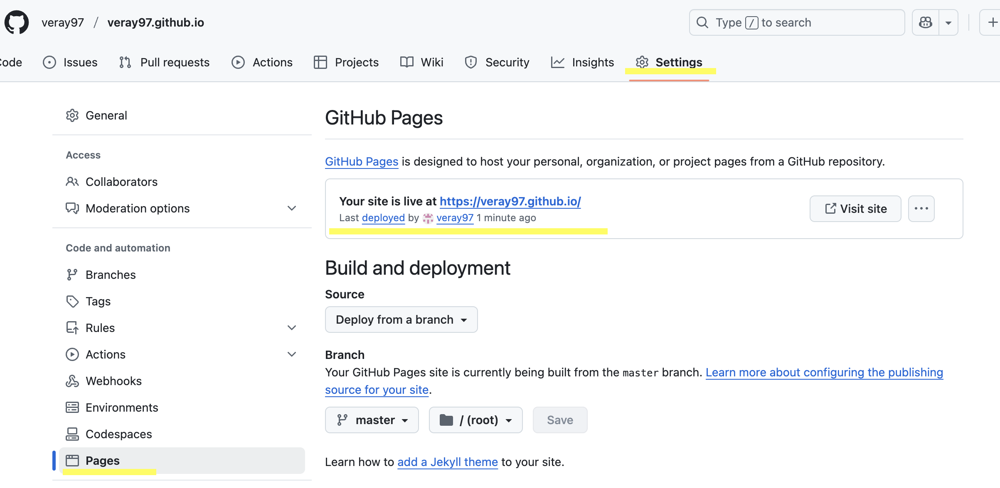
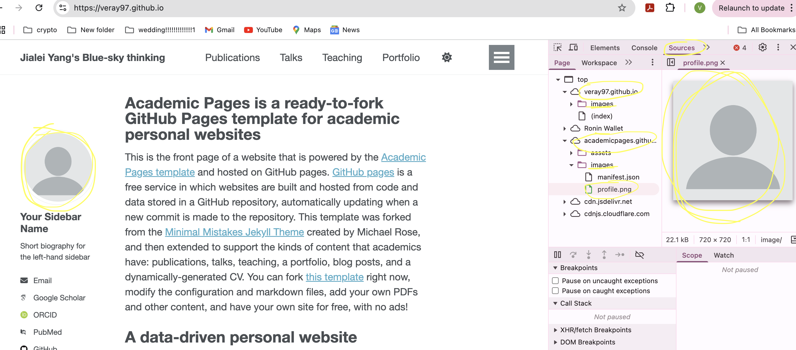

# Goal
**Use the Academic Page template in https://github.com/academicpages/academicpages.github.io to create your personal academic webpage

## Step 1: 

Open the https://github.com/academicpages/academicpages.github.io, follow the "Getting Started" step in theb "README.md" to mimic the template in your own repository

### Getting Started
1. Register a GitHub account if you don't have one and confirm your e-mail (required!)
1. Click the "Use this template" button in the top right.
1. On the "New repository" page, enter your repository name as "[your GitHub username].github.io", which will also be your website's URL.
1. Set site-wide configuration and add your content.
1. Upload any files (like PDFs, .zip files, etc.) to the `files/` directory. They will appear at https://[your GitHub username].github.io/files/example.pdf.
1. Check status by going to the repository settings, in the "GitHub pages" section
1. (Optional) Use the Jupyter notebooks or python scripts in the `markdown_generator` folder to generate markdown files for publications and talks from a TSV file.

### Webpage

You can now open your webpage through the link

## Trouble shooting as this step:

(One problem may occur if you didn't name the github webpage as https://[your GitHub username].github.io. For example, if I name the repocitory as verayang.github.io, then there may the problem shown below. This can not be fixed even though you rename this created repository. The solution is to repeat the "getting started" step and name the repository correctly when you create it.)

Error: At the beginning of this step, if you open your webpage (as for me, it's https://veray97.github.io/), and open the "developer tools"-"Sources". You can see that the repository used under this webpage. If it's shown as below, which is that a part of it is still acadeicpages.github.io. It means that the edits you made and the images you added under your repository will not be recognized by the webpage.

## Step 2:
The main configuration file for the site is in the base directory in _config.yml, which defines the content in the sidebars and other site-wide features. You will need to replace the default variables with ones about yourself and your site’s github repository. The configuration file for the top menu is in _data/navigation.yml. For example, if you don’t have a portfolio or blog posts, you can remove those items from that navigation.yml file to remove them from the header.
